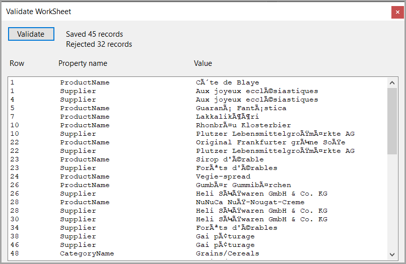

# About

Code sample to show how to validate several properties when reading data from an Excel WorkSheet using FluentValidation.

- ExcelMapper to read Excel data
- FluentValidation to validate data
- EF Core to save validate data to a database

## Before running the sample

In Azure Data Studio or SSMS create the database under localDb named ExcelMapperSamples followed by running the script in the file Scripts\populate.sql.

## Interface

Was kept simple, just enough to results.

