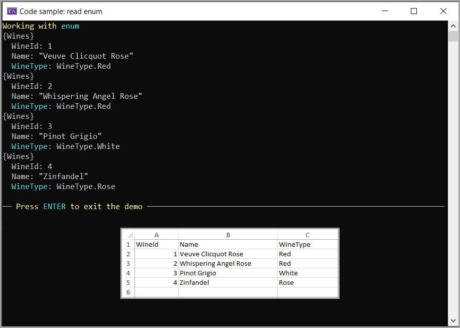

# About

This is a sample app to demonstrate how to read a worksheet with a model having a enum property.



```csharp
public class Wines
{
    public int WineId { get; set; }
    public string Name { get; set; }
    public WineType WineType { get; set; }
}
public enum WineType
{
    Red = 1,
    White = 2,
    Rose = 3
}
```
